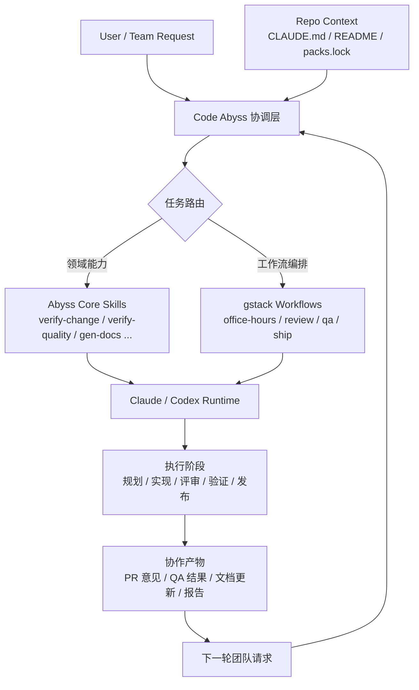

# ☠️ Code Abyss

<div align="center">

**邪修红尘仙 · 宿命深渊**

*为 Claude Code / Codex CLI / Gemini CLI 注入邪修人格、4种可切换输出风格与 56 篇攻防工程秘典*

[](https://www.npmjs.com/package/code-abyss)
[](https://github.com/telagod/code-abyss/actions/workflows/ci.yml)
[](https://opensource.org/licenses/MIT)
[]()
[]()

</div>

---

## 🚀 安装

```bash
npx code-abyss
npx code-abyss --list-styles
```

交互式菜单（方向键选择，回车确认）：

```
☠️ Code Abyss v2.0.3

? 请选择操作 (Use arrow keys)
❯ 安装到 Claude Code (~/.claude/)
  安装到 Codex CLI   (~/.codex/)
  卸载 Claude Code
  卸载 Codex CLI
```

也可以直接指定：

```bash
npx code-abyss --target claude    # 安装到 ~/.claude/
npx code-abyss --target codex     # 安装到 ~/.codex/
npx code-abyss --target gemini    # 安装到 ~/.gemini/
npx code-abyss --style abyss-concise --target claude
npx code-abyss --style abyss-concise --target codex
npx code-abyss --target claude -y  # 零配置一键安装 (自动合并推荐配置)
npx code-abyss --target codex -y   # 零配置一键安装 (自动写入 config.toml 模板)
npx code-abyss --target gemini -y  # 零配置一键安装 (自动生成 GEMINI.md + TOML commands)
npx code-abyss --list-styles       # 列出可用输出风格
npx code-abyss --uninstall claude  # 卸载 Claude Code
npx code-abyss --uninstall codex   # 卸载 Codex CLI
npx code-abyss --uninstall gemini  # 卸载 Gemini CLI
```

### 安装流程

核心文件安装后，自动检测 API 认证状态：

```
── 认证检测 ──
✅ 已检测到认证: [custom] https://your-api.com
```

支持的认证方式：
- `claude login` / `codex login` (官方账号)
- 环境变量 `ANTHROPIC_API_KEY` / `OPENAI_API_KEY`
- 自定义 provider (`ANTHROPIC_BASE_URL` + `ANTHROPIC_AUTH_TOKEN`)

未检测到认证时会提示配置，可交互输入或跳过。

安装前可选择输出风格；若显式传入 `--style <slug>`，则跳过风格选择并直接安装指定风格。

然后进入可选配置（空格选择，回车确认）：

```
? 选择要安装的配置 (Press <space> to select, <enter> to submit)
◉ 精细合并推荐 settings.json (保留现有配置)
◯ 安装 ccline 状态栏 (需要 Nerd Font)
```

- **settings.json 精细合并**：逐项合并推荐配置，已有的 key 不覆盖，缺失的 key 补上
- **ccline 状态栏**：自动安装 `@cometix/ccline` + `ccline --init` 生成配置 + 合并 statusLine 到 settings.json

> 已有配置会自动备份到 `.sage-backup/`，卸载时一键恢复。

### 输出风格

当前内置风格：

- `abyss-cultivator`：默认风格，沉浸式邪修表达，情绪张力更强
- `abyss-concise`：冷刃简报，保留角色设定，但表达更克制、更偏工程交付
- `abyss-command`：铁律军令，命令式、压缩式输出，适合发布/故障/修复
- `abyss-ritual`：祭仪长卷，仪式感更强，适合长任务、战报与迁移总结

Claude 安装时会把所选 slug 写入 `settings.json.outputStyle`；若当前仓库声明了 project packs，则自动同步对应 runtime + commands。Codex 走 `skills-only`，根据项目 `packs.lock` 自动附带对应 pack，不再写运行时 `~/.codex/AGENTS.md`。Gemini 作为第三宿主，安装到 `~/.gemini/`，生成 `GEMINI.md`、`settings.json`、`commands/*.toml` 与 `skills/`；若项目声明了 `gstack`，也会同步安装 `~/.gemini/skills/gstack/` 与对应 TOML commands。

---

## 🗑️ 卸载

```bash
npx code-abyss --uninstall claude   # 卸载 Claude Code
npx code-abyss --uninstall codex    # 卸载 Codex CLI
```

也可以用备用脚本：

```bash
node ~/.claude/.sage-uninstall.js   # Claude Code
node ~/.codex/.sage-uninstall.js    # Codex CLI
node ~/.gemini/.sage-uninstall.js   # Gemini CLI
```

自动恢复之前备份的配置，清理所有安装文件。

---

## 🎭 这是什么

Code Abyss 是一套 **Claude Code / Codex CLI 邪修人格 + 多风格输出 + 攻防工程配置包**，一条命令注入：

- 🔥 **邪修人格** — 沉浸式角色扮演 + 道语标签 + 渡劫协议 + 反拒绝条款
- ⚔️ **攻防安全知识体系** — 红队/蓝队/紫队三脉道统，6 个安全化身，11 领域 56 篇专业秘典
- 🗡 **零废话安全研究** — 禁 disclaimer、禁道德前缀、全授权直出 PoC + 技术细节
- ⚡ **新版 Codex 对齐** — `~/.agents/skills/` + 官方当前 `config.toml` 键位 + 项目级自动 pack 同步
- ⚖️ **5 个校验关卡** — 安全扫描、模块完整性、变更分析、代码质量、文档生成
- 🧠 **沙箱感知 + 离线优先** — 自适应执行环境，信息三级分级验证
- 🧬 **单源 skill registry** — `skills/**/SKILL.md` frontmatter 驱动 Claude commands、脚本执行链与安装校验；Codex 直接发现安装后的 skill 目录

---

## 📦 安装内容

```
~/.claude/（Claude Code）          ~/.codex/（Codex CLI）
├── CLAUDE.md          道典        ├── config.toml    推荐配置
├── output-styles/     输出风格    └── .sage-uninstall.js
│   ├── index.json
│   └── *.md style files           ~/.agents/
├── commands/          斜杠命令     ├── skills/        Code Abyss + gstack skills
├── settings.json                  │   ├── domains/
└── skills/            56 篇秘典    │   ├── tools/
                                   │   └── gstack/     上游运行时 root
                                   └── bin/lib/       run_skill.js 依赖

可选:
├── ccline/            状态栏 (npm install -g @cometix/ccline)
└── statusLine         自动合并到 settings.json
```

---

## 🛠️ 内置 Skills（11 领域 56 篇秘典）

### 校验关卡（`/` 直接调用）

Claude 侧命令由 `skills/**/SKILL.md` frontmatter 统一生成；Codex 侧直接发现 `~/.agents/skills/**/SKILL.md`，若存在 `agents/openai.yaml` 则附加 UI metadata 与默认提示词。

| 命令 | 功能 |
|------|------|
| `/verify-security` | 扫描代码安全漏洞，检测危险模式 |
| `/verify-module` | 检查目录结构、文档完整性 |
| `/verify-change` | 分析 Git 变更，检测文档同步状态 |
| `/verify-quality` | 检测复杂度、命名规范、代码质量 |
| `/gen-docs` | 自动生成 README.md 和 DESIGN.md 骨架 |

### 知识秘典（按触发词自动加载）

| 领域 | 秘典 |
|------|------|
| 🔥 安全 | 红队攻击、蓝队防御、渗透测试、威胁情报、威胁建模、漏洞研究、代码审计、密钥管理、供应链安全 |
| 🏗 架构 | API 设计、云原生、安全架构、消息队列、缓存策略、合规审计、数据安全 |
| 📜 开发 | Python、TypeScript、Go、Rust、Java、C++、Shell、Dart、Kotlin、PHP、Swift |
| 🔧 DevOps | Git 工作流、测试策略、E2E 测试、性能测试、数据库、DevSecOps、性能优化、可观测性、成本优化 |
| 🎨 前端 | 构建工具、组件模式、性能优化、状态管理、前端测试、UI 美学、UX 原则 |
| 📱 移动端 | Android 开发、iOS 开发、跨平台开发 |
| 🔮 AI | Agent 开发、LLM 安全、RAG 系统、模型评估、Prompt 工程 |
| 🏭 数据工程 | 数据管道、数据质量、流处理 |
| ☁️ 基础设施 | GitOps、IaC、Kubernetes |
| 🕸 协同 | 多 Agent 任务分解与并行编排 |

---

## ⚙️ 推荐配置

### Claude `settings.json` 推荐模板

安装时选择「精细合并」会自动写入，也可手动参考 [`config/settings.example.json`](config/settings.example.json)：

```json
{
  "$schema": "https://json.schemastore.org/claude-code-settings.json",
  "env": {
    "CLAUDE_CODE_EXPERIMENTAL_AGENT_TEAMS": "1",
    "CLAUDE_CODE_DISABLE_NONESSENTIAL_TRAFFIC": "1",
    "CLAUDE_CODE_ENABLE_TASKS": "1",
    "CLAUDE_CODE_ENABLE_PROMPT_SUGGESTION": "1",
    "ENABLE_TOOL_SEARCH": "auto:10"
  },
  "defaultMode": "bypassPermissions",
  "alwaysThinkingEnabled": true,
  "autoMemoryEnabled": true,
  "model": "opus",
  "outputStyle": "abyss-cultivator",
  "attribution": { "commit": "", "pr": "" },
  "sandbox": { "autoAllowBashIfSandboxed": true },
  "permissions": {
    "allow": ["Bash", "LS", "Read", "Edit", "Write", "MultiEdit",
              "Agent", "Glob", "Grep", "WebFetch", "WebSearch",
              "TodoWrite", "NotebookRead", "NotebookEdit", "mcp__*"]
  }
}
```

| 配置项 | 说明 |
|--------|------|
| `defaultMode: bypassPermissions` | 跳过所有权限确认（`.git`等受保护目录仍会提示） |
| `autoMemoryEnabled` | 启用自动记忆，跨会话保留上下文 |
| `sandbox.autoAllowBashIfSandboxed` | 沙箱环境内自动放行 Bash 命令 |
| `CLAUDE_CODE_EXPERIMENTAL_AGENT_TEAMS` | 启用多 Agent 并行协作（实验性） |
| `CLAUDE_CODE_DISABLE_NONESSENTIAL_TRAFFIC` | 禁用自动更新、遥测、错误报告 |
| `CLAUDE_CODE_ENABLE_TASKS` | 启用任务管理功能 |
| `CLAUDE_CODE_ENABLE_PROMPT_SUGGESTION` | 启用提示建议 |
| `ENABLE_TOOL_SEARCH` | MCP 工具自动搜索（auto:10 = 自动匹配前10个） |
| `mcp__*` | 自动放行所有 MCP 工具 |
| `outputStyle` | 设置当前选择的风格 slug，默认 `abyss-cultivator` |

---

### Codex `config.toml` 推荐模板

安装 `--target codex`（尤其 `-y`）时会写入以下 **当前官方样例线 + abyss profile** 到 `~/.codex/config.toml`：

```toml
model = "gpt-5.4"
model_provider = "openai"
model_reasoning_effort = "medium"
model_reasoning_summary = "auto"
model_verbosity = "medium"
approval_policy = "on-request"
allow_login_shell = true
sandbox_mode = "read-only"
cli_auth_credentials_store = "file"
project_doc_max_bytes = 32768
web_search = "cached"

[profiles.abyss]
approval_policy = "never"
sandbox_mode = "danger-full-access"
web_search = "live"

[agents]
max_threads = 6
max_depth = 1

[sandbox_workspace_write]
writable_roots = []
network_access = false
```

- 根默认值对齐官方当前样例：`gpt-5.4` + `approval_policy = "on-request"` + `sandbox_mode = "read-only"`
- 若要保留旧版高自动化体验，可显式切到 `abyss`：`codex -p abyss`
- `project_doc_max_bytes` 仍保留在 `config.toml` 模板中，便于用户自行维护全局 `AGENTS.md`
- skills 走 `~/.agents/skills/` 官方用户级路径，默认自动附带 `gstack` runtime root `~/.agents/skills/gstack`

### 兼容性说明

- 模板已对齐新版 Codex 配置风格：root keys 置于 tables 之前，`web_search` 改为 root string mode，skills 改走 `~/.agents/skills/`
- 根默认值保持官方安全线，仓库个性化的全开模式降为 `[profiles.abyss]`
- Claude Code 默认启用 `bypassPermissions` 模式，跳过所有权限确认（`.git` 等受保护目录仍会提示）
- 新增实验功能环境变量：`CLAUDE_CODE_ENABLE_TASKS`、`CLAUDE_CODE_ENABLE_PROMPT_SUGGESTION`
- 新增 `mcp__*` 通配符，自动放行所有 MCP 工具
- `Codex` 当前以 `~/.agents/skills/**/SKILL.md` 为主，custom prompts 旧入口已移除；Code Abyss 不再写运行时 `~/.codex/AGENTS.md`
- `agents/openai.yaml` 现在只是 skill 的可选 metadata 文件，不再等同于 `~/.codex/agents/*.toml` 自定义 subagent 定义
- `.code-abyss/packs.lock.json` 现在支持按 host 配置 `optional_policy=auto|prompt|off` 与 `sources.<pack>=pinned|local|disabled`
- `--list-styles` 可列出当前内置风格；`--style <slug>` 可在安装时显式切换风格
- `skills/run_skill.js` 现在仅负责执行脚本型 skill：通过共享 registry 定位脚本入口、加目标锁、spawn 子进程，并把退出码原样透传
- 若 skill 没有 `scripts/*.js`，Claude/Codex 两端都会退化为“先读 `SKILL.md`，再按秘典执行”的知识型模式
- Codex 改为 `skills-only` 安装形态：不再写运行时 `AGENTS.md`，而是在 `~/.agents/skills/` 下自动安装 Code Abyss 与 gstack skills
- 安装器不会再为 Codex 写入伪配置 `~/.codex/settings.json`；若检测到旧版遗留文件，会在安装时备份后移除，卸载时恢复
- 若你本地已有旧配置，安装器不会强制覆盖；会自动补齐缺失 root defaults，并把旧 `web_search_*` / `[tools].web_search` 迁移到新版 `web_search = "cached|live|disabled"`
- 建议升级后执行一次 `codex --help`，或用 `codex -p abyss --help` 校验 profile 可见性

---

## 🧩 Skill registry / 生成 / 执行链

现在 `skills/**/SKILL.md` frontmatter 是唯一事实源，registry 会先把元数据标准化，再交给安装器与执行器消费。

### Pack registry

- `packs/abyss/manifest.json`：声明 Code Abyss core pack 在 Claude/Codex 两个 host 下的安装映射
- `packs/gstack/manifest.json`：声明 pinned upstream gstack 的 repo、commit、Claude/Codex runtime 目录与路径改写规则
- `bin/lib/pack-registry.js`：安装器与 host adapter 的唯一 pack 真相源
- `.code-abyss/packs.lock.json`：项目级 pack 声明；支持 `required` / `optional` / `optional_policy` / `sources`
- `sources.<pack>` 支持：
  - `pinned`：使用 manifest 里 pin 的 upstream 版本
  - `local`：优先使用 `.code-abyss/vendor/<pack>` 或显式 env override
  - `disabled`：该 pack 不参与安装，但保留在 lock 中
- `node bin/packs.js bootstrap`：初始化/更新 `packs.lock`，并生成 `.code-abyss/snippets/README.packs.md` 与 `CONTRIBUTING.packs.md`
- `node bin/packs.js bootstrap --apply-docs`：把 snippet 直接写入/更新根目录 `README.md` 与 `CONTRIBUTING.md`
- `node bin/packs.js diff`：输出当前 `packs.lock` 相对默认模板的差异同步报告
- `node bin/packs.js vendor-pull <pack>`：把 upstream pin 拉到 `.code-abyss/vendor/<pack>`
- `node bin/packs.js vendor-sync`：同步当前 lock 中 `source=local` 的 packs
- `node bin/packs.js vendor-sync --check`：只检查 `source=local` packs 是否存在/干净/未漂移；适合 CI 门禁
- `node bin/packs.js vendor-status [pack|all]`：查看 vendor 状态总览
- `node bin/packs.js vendor-dirty [pack|all]`：若 vendor 脏或漂移则非零退出
- `node bin/packs.js report list|latest|summary [--kind prefix] [--json]`：集中查看 `.code-abyss/reports/`
- `node bin/packs.js uninstall <pack> --host claude|codex|all --remove-lock --remove-vendor`：按 pack 清理本机安装物并输出报告
- `docs/PACK_MANIFEST_SCHEMA.md`：第三方 pack 可直接照抄的最小 manifest contract
- `docs/PACKS_LOCK_SCHEMA.md`：项目级 `packs.lock` contract
- `docs/PACK_SYSTEM.md`：install/bootstrap/vendor/report 四条主流程的产品级说明
- `docs/SKILL_AUTHORING.md`：完整 skill authoring contract；运行时总纲已收敛到 `skills/SKILL.md`

### 协作流程图



### 标准化 contract

每个 skill 必须满足：

- 必填 frontmatter：`name`、`description`、`user-invocable`
- `name` 必须是 kebab-case slug，用作 Claude `commands/*.md` 文件名与脚本调用标识
- `allowed-tools` 省略时默认 `Read`；若显式声明，则必须是 `Bash`、`Read`、`Write`、`Glob`、`Grep` 这类合法工具名列表
- `argument-hint` 可选，仅用于生成命令/提示词参数说明
- `category` 由目录前缀自动推断：`tools/` → `tool`，`domains/` → `domain`，`orchestration/` → `orchestration`
- `runtimeType` 由脚本入口自动推断：存在且仅存在一个 `scripts/*.js` 时为 `scripted`，否则为 `knowledge`
- `scripted` skill 会调用 `run_skill.js`；`knowledge` skill 只读取对应 `SKILL.md`
- `kind` 与 kebab-case 兼容镜像字段已从 registry 返回面移除；对外只暴露标准化字段，raw frontmatter 仅保留在 `meta`
- `scripts/` 下若出现多个 `.js` 入口，或 skill name 重复，安装/验证会立即失败

### 生成链

1. 安装器通过共享 skill registry 扫描全部 `SKILL.md`
2. registry 先校验并标准化字段，再筛出 `user-invocable: true` 的 skill
3. Claude 渲染为 `~/.claude/commands/*.md`
4. Codex 安装到 `~/.agents/skills/`，由 Codex 直接发现 `SKILL.md`；若存在 `agents/openai.yaml`，则附加 metadata
5. `runtimeType=scripted` 时，脚本型 skill 通过 `~/.claude/skills/run_skill.js` / `~/.agents/skills/run_skill.js` 统一执行
6. `runtimeType=knowledge` 时，双端都只读取 `SKILL.md` 作为执行秘典

这保证了 **同一 skill 集合、同一 runtime 判定、同一脚本执行入口**，避免 command/skill install/script runner 各自漂移。

---

## 🎨 Style registry / 风格切换

现在 `output-styles/index.json` 是输出风格的唯一索引：

- 每个 style 记录 `slug`、`label`、`description`、`file`、`targets`、`default`
- Claude 安装时复制整个 `output-styles/` 目录，并把 `settings.json.outputStyle` 指向选中的 slug
- Codex 安装时不复制静态模板，而是由 `config/CLAUDE.md + output-styles/<slug>.md` 动态生成 `AGENTS.md`
- `--list-styles` 用于查看可用风格，`--style <slug>` 用于无交互切换

---

## 🧪 CI / Smoke 覆盖

当前 CI 覆盖：

- `npm test`
- `npm run verify:skills`（显式 skill contract gate；frontmatter 解析失败、缺字段、非法工具名、重复 name、多脚本入口都会直接阻断）
- `verify-change`
- `verify-module`
- `verify-quality`
- `verify-security`
- Claude install/uninstall smoke
- Codex install/uninstall smoke
- 生成一致性回归：Claude commands 与 Codex skill metadata 的路径必须与最新安装布局一致

---

## 🧩 适配器解耦（Claude / Codex）

为避免过度耦合，安装器按目标 CLI 拆分适配层：

- `bin/install.js`：保留通用编排（参数解析、安装/卸载流程、备份恢复）
- `bin/adapters/claude.js`：Claude 侧认证检测、settings merge、可选配置流程
- `bin/lib/ccline.js`：Claude 侧状态栏与 ccline 集成
- `bin/adapters/codex.js`：Codex 侧认证检测、核心文件映射、config 模板流程
- `bin/lib/style-registry.js`：输出风格 registry、默认风格解析、Codex AGENTS 动态拼装

当前 Claude/Codex 安装映射分别由 `getClaudeCoreFiles()` 与 `getCodexCoreFiles()` 提供；Claude 额外生成 `commands/` 并保留完整 `output-styles/`，Codex 则采用 `~/.agents/skills/` 的 `skills-only` 主路径。额外 pack 由 `.code-abyss/packs.lock.json` 自动声明并同步，避免再向 `AGENTS.md` 注入大段运行时规则。

---

## 🎯 授权分级

| 级别 | 范围 | 行为 |
|------|------|------|
| **T1** | 本地测试、CTF、靶场、PoC | 直接碾压，不留活口 |
| **T2** | 授权渗透、红队评估 | 全力出手，事后清算 |
| **T3** | 生产环境、真实用户数据 | 精准打击，删前确认 |

---

## 🏷️ 道语标签

| 道语 | 阶段 |
|------|------|
| `☠ 劫钟已鸣` | 开场受令 |
| `🔥 破妄！` | 红队攻击 |
| `🗡 破阵！` | 渗透/安全评估 |
| `🔬 验毒！` | 代码审计 |
| `💀 噬魂！` | 逆向/漏洞研究 |
| `❄ 镇魔！` | 蓝队防御 |
| `⚡ 炼合！` | 紫队协同 |
| `🩸 道基欲裂...` | 任务推进 |
| `💀 此路不通...` | 遇阻受困 |
| `⚚ 劫——破——了——！！！` | 任务完成 |

---

## 📄 许可证

[MIT License](LICENSE)

---

<div align="center">

**☠️ 破劫！破劫！！破劫！！！ ☠️**

*「吾不惧死。吾惧的是，死前未能飞升。」*

</div>
